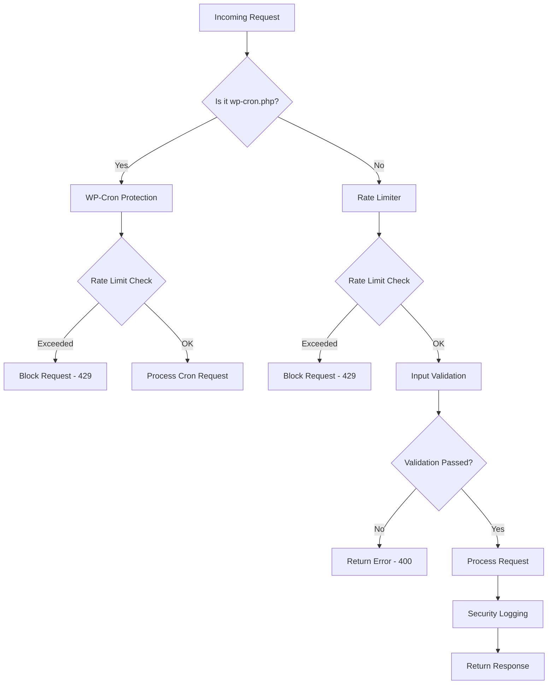
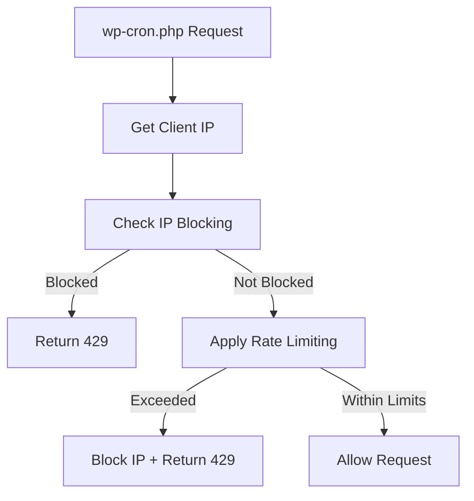
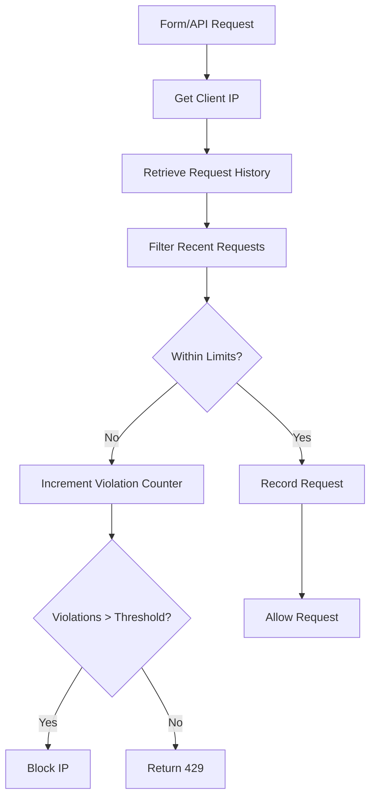
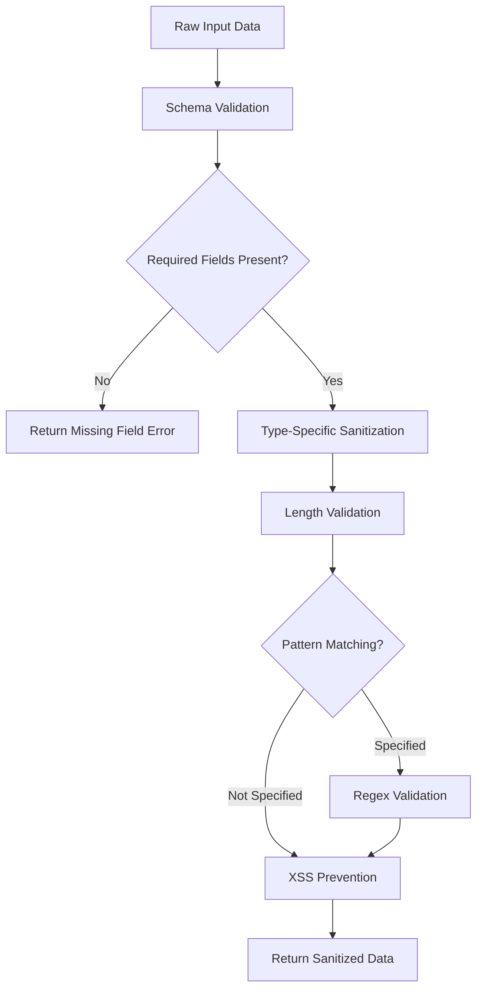
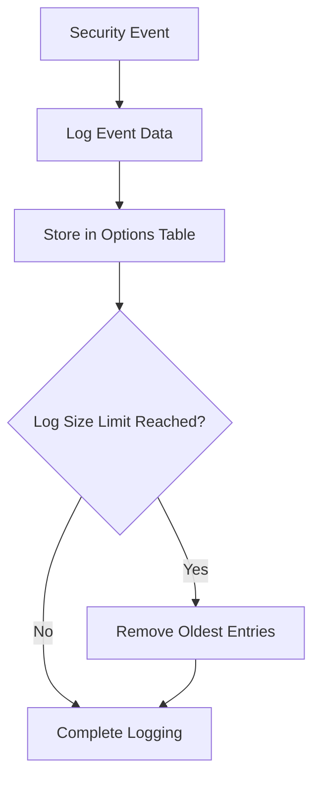
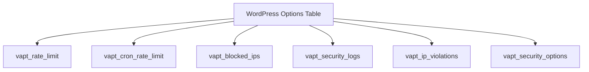

# VAPT Security Plugin Architecture

## Overview

The VAPT Security plugin implements a multi-layered security approach to protect WordPress sites from common vulnerabilities:

## Component Details

### 1. WP-Cron Protection Layer

Protects against DoS attacks targeting wp-cron.php:

#### Key Features:
- IP-based rate limiting specifically for cron requests
- Automatic IP blocking for abusive patterns
- Configurable request limits
- Integration with proxy/Cloudflare IP detection

### 2. Rate Limiting Layer

General purpose rate limiting for all requests:

#### Key Features:
- Configurable time windows and request limits
- Violation tracking to identify abusive IPs
- Automatic cleanup of old request data
- Separate tracking for regular vs cron requests

### 3. Input Validation Layer

Comprehensive input sanitization and validation:

#### Key Features:
- Schema-based validation approach
- Multiple sanitization levels (Basic, Standard, Strict)
- XSS prevention techniques
- Email, URL, and custom validation
- Regex pattern support

### 4. Security Logging Layer

Monitoring and auditing of security events:

#### Key Features:
- Event categorization (form submissions, blocked requests, etc.)
- Statistical reporting dashboard
- Automatic cleanup of old logs
- IP-based event tracking

## Data Flow

### Request Processing Flow

1. **Initial Request Interception**
   - All requests pass through WordPress hook system
   - Special handling for wp-cron.php requests
   - IP address identification with proxy support

2. **Rate Limiting Check**
   - Lookup request history for client IP
   - Apply configured limits
   - Block or allow request based on results

3. **Input Validation**
   - Sanitize all input data
   - Validate against defined schemas
   - Apply XSS prevention measures

4. **Processing**
   - Execute requested functionality
   - Apply additional security checks as needed

5. **Logging**
   - Record security-relevant events
   - Update statistics
   - Maintain audit trail

### Data Storage Architecture

#### Storage Components:
- **vapt_rate_limit**: Tracks regular request patterns
- **vapt_cron_rate_limit**: Tracks cron request patterns
- **vapt_blocked_ips**: List of currently blocked IPs
- **vapt_security_logs**: Security event logs
- **vapt_ip_violations**: IP violation counters
- **vapt_security_options**: Plugin configuration

## Performance Optimizations

### 1. Efficient Data Structures
- JSON-encoded arrays for compact storage
- Timestamp-based filtering for quick lookups
- Limited history retention to control growth

### 2. Scheduled Maintenance
- Hourly cleanup of temporary data
- Daily optimization of stored data
- Automatic removal of expired blocks

### 3. Minimal Overhead
- Lightweight processing for normal requests
- Cached lookups where possible
- Asynchronous operations for non-critical tasks

## Security Best Practices Implemented

### 1. Defense in Depth
- Multiple layers of protection
- Redundant validation mechanisms
- Fail-safe defaults

### 2. Secure Defaults
- Conservative initial settings
- Explicit enablement of features
- Safe fallback behaviors

### 3. Monitoring and Auditing
- Comprehensive event logging
- Statistical analysis capabilities
- Violation tracking for threat identification

## Integration Points

### WordPress Hooks Used
- `init` - For early request interception
- `admin_menu` - For settings page registration
- `admin_init` - For settings registration
- `wp_ajax_*` - For form processing
- `cron_schedules` - For custom intervals

### Compatibility Features
- Works with WordPress object cache
- Supports multisite installations
- Integrates with popular security plugins
- Compatible with CDN and proxy services